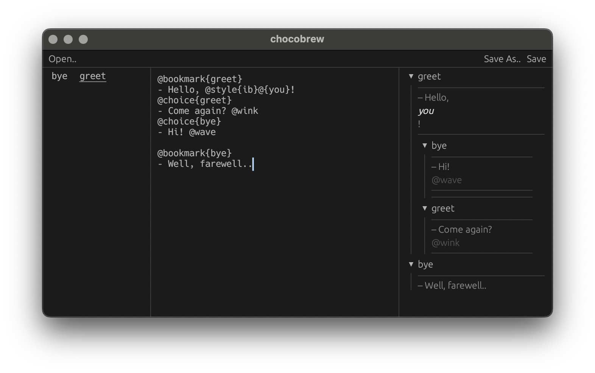

[](https://crates.io/crates/chocobrew)
[](https://docs.rs/chocobrew)
[](https://github.com/30bit/choco/actions/workflows/ci.yml)



Chocobrew is a text editor for [Choco](https://crates.io/crates/choco) markup language.
Releases are available at [github](https://github.com/30bit/choco/releases) as well as via `cargo`:

```sh
cargo install chocobrew
```
